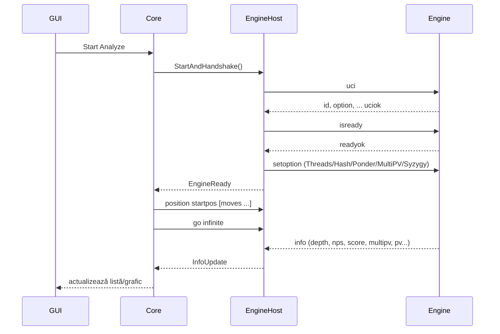
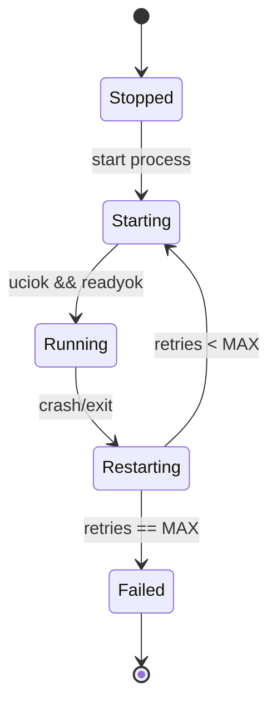
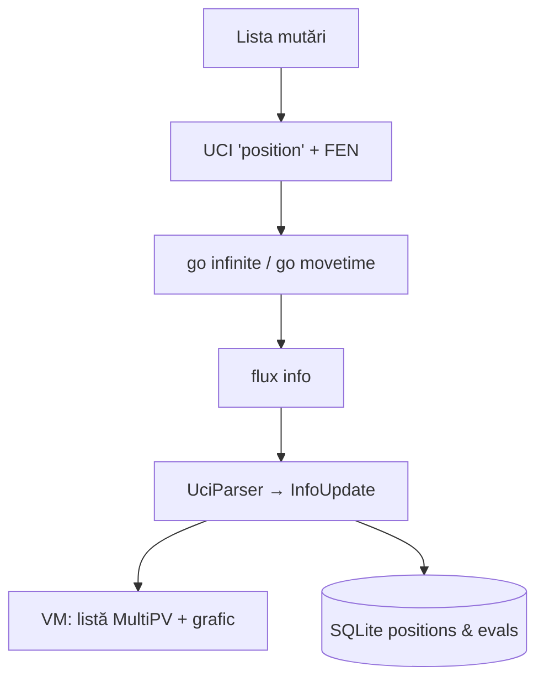

# DIAGRAME

## Arhitectură (component overview)
```mermaid
flowchart TD
  GUI[WPF GUI] --> Core[Core]
  Core --> Interop[Interop]
  Interop <-->|stdin/stdout (UCI)| Engine[UCI Engine (Stockfish)]
  Core -->|read/write| Data[(Data/ appsettings.json, profiles.json)]
```

## Handshake UCI (sequence)


## Process Supervisor (state)


## Analiza — pipeline

